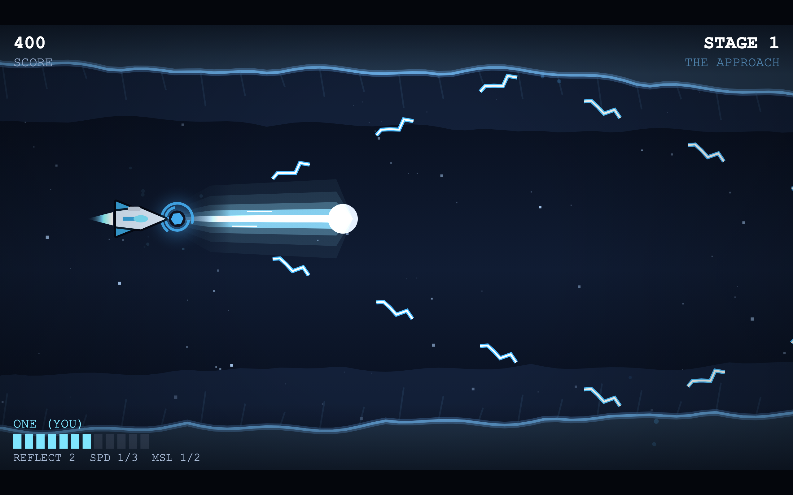
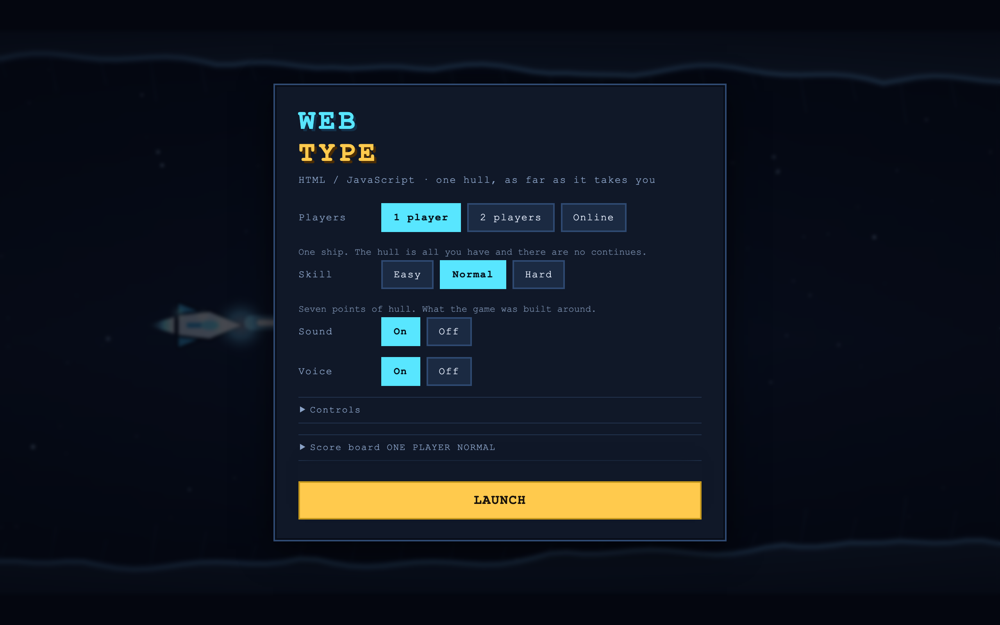
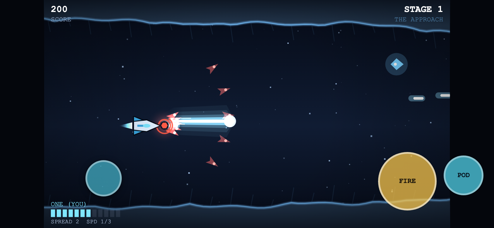
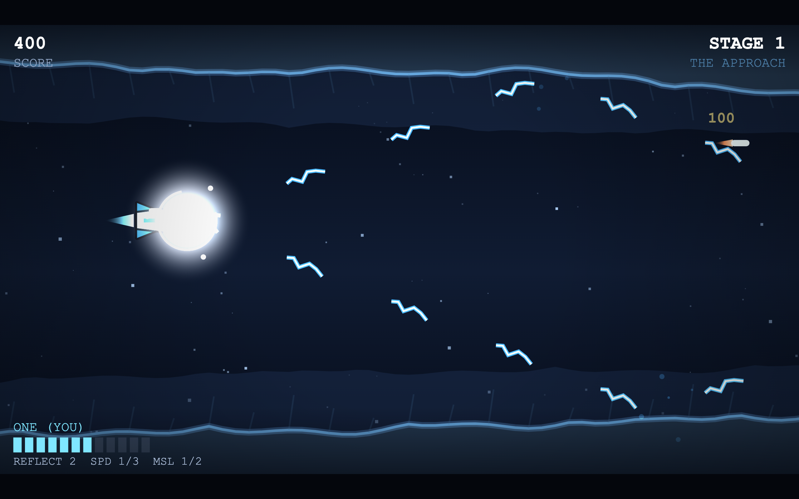
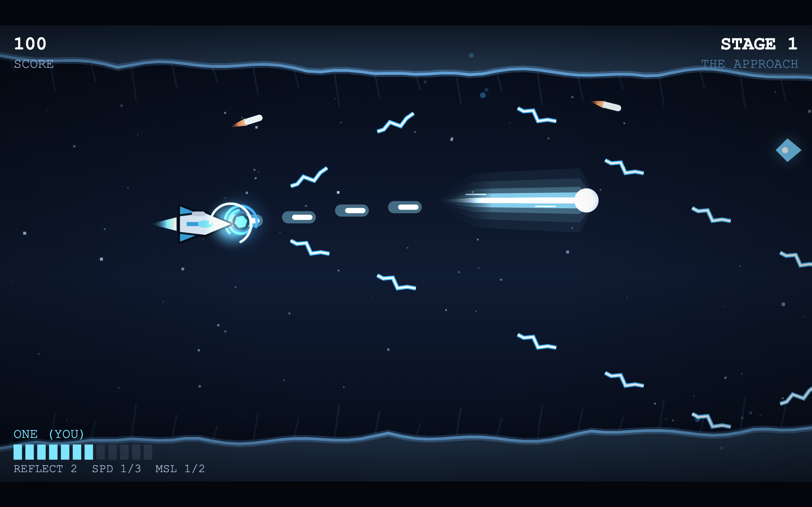
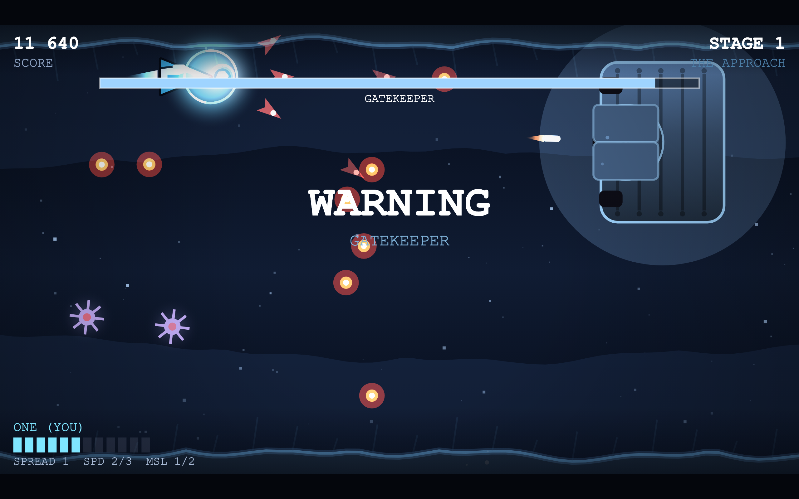
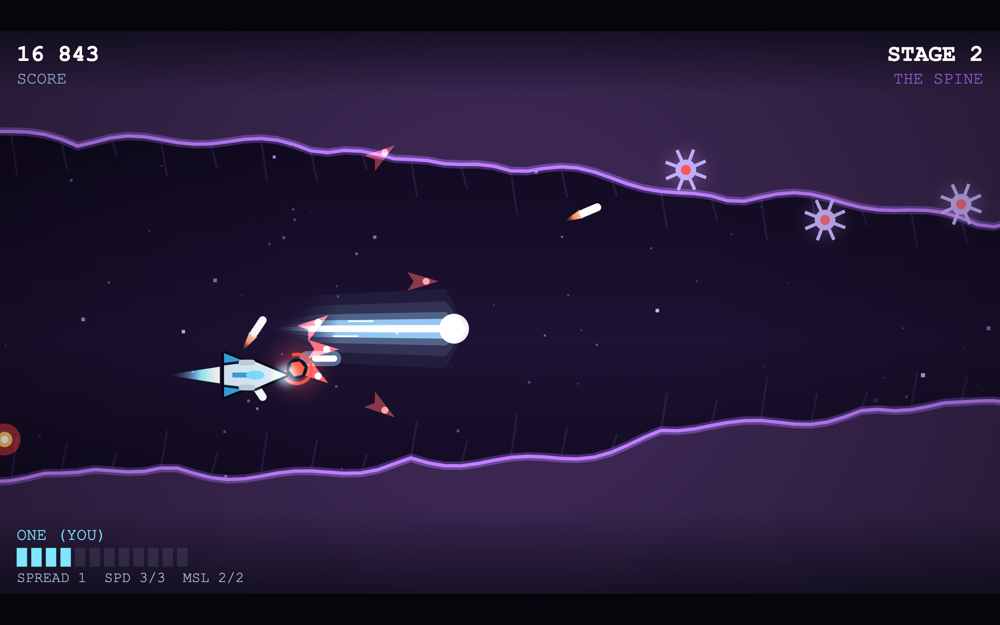
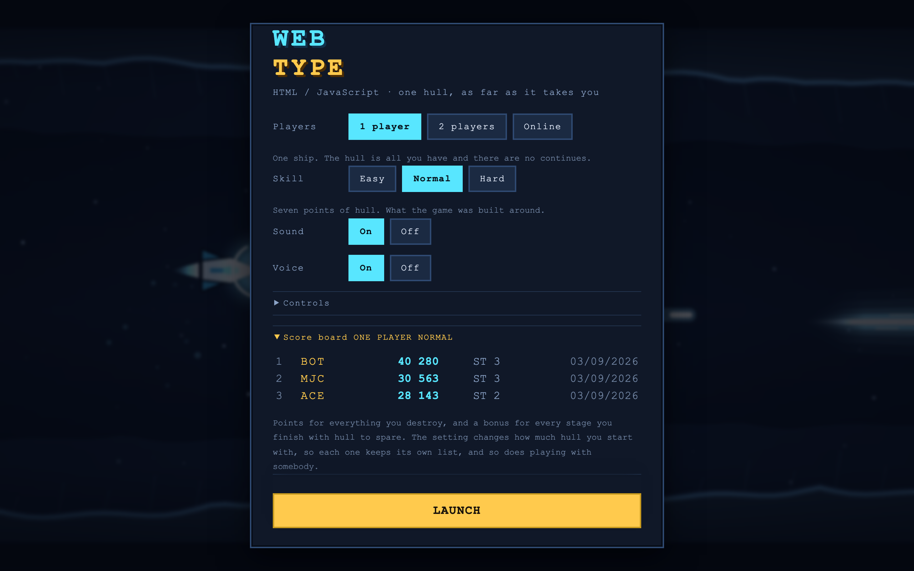

# WebType

### ▶ [Play it](https://markclausing.github.io/webtype/)

A horizontal shoot-em-up in the spirit of the 16-bit corridor shooters: a small
ship, a gun you have to hold down, an indestructible pod you can push off the
front of it, and five stages of rock and ordnance between you and a boss.
**1 player**, **2 round one keyboard**, or **2 online** with a four-character
room code.

You have one hull and there are no continues. How far you get is how much you
score, and both go on a shared board.

No dependencies, no build step — HTML, CSS and JavaScript exactly as the browser
receives them. It is the fourth game built this way, after
[websoccer](https://github.com/markclausing/websoccer),
[webtennis](https://github.com/markclausing/webtennis) and
[webracing](https://github.com/markclausing/webracing).



## Running it yourself

```bash
git clone https://github.com/markclausing/webtype.git
cd webtype && npm start
```

Then open http://localhost:5173/. There is no `npm install`.



## Controls

|                        | Player 1        | Player 2        |
| ---------------------- | --------------- | --------------- |
| Fly                    | `W` `A` `S` `D` | Arrow keys      |
| Fire, hold to charge   | `Space`         | `Enter`         |
| Pod out / back         | `Q`             | `R Shift`       |
| Pause                  | `Esc`           |                 |

Every key can be changed in the menu. Gamepads need no setting up: the first pad
shares with player one, a second pad is player two.

On a phone, hold it sideways. The bottom-left corner is the stick, `FIRE` is the
big button and `POD` is the small one beside it. The whole playfield is drawn
whatever the screen, because it has to be — see below.



## How it plays

**Tap fire for pellets, hold it for a beam.** Holding winds the gun up and
releasing lets it go; below about a third of a second there is no beam, so a
tapped button is a pea shooter and nothing is ever swallowed. A full charge goes
straight through everything in the corridor, and a lot of what is in the later
stages does not die to anything else. That is the whole rhythm of the game: the
question every few seconds is whether you can afford to stop shooting.



**The pod is a shield you have to aim.** On the nose or the tail it eats every
shot that hits it and grinds through anything it touches, and it cannot be
destroyed. Press the second button and it flies off forwards and hangs there,
still firing, which turns it from a shield into a turret you have placed. Press
it again and it comes home — and if you fly past it while it is out there, it
comes back onto your tail instead of your nose, which is how you cover the thing
that is chasing you.



**The crystals are three weapons, not three levels.** Red is a fan of short-lived
shards, murderous at the range where being that close is a bad idea. Blue bounces
off the ceiling and the floor, so the corridor itself becomes part of the gun.
Yellow is slow rings that go looking for what you cannot see. A second crystal of
the same colour makes that weapon stronger; a different colour starts again from
the bottom. Every one of them is at a fixed mark, so which you end a stage
carrying is a decision rather than an accident.

**The hull is the whole game.** There are no lives and no continues. You start
with five to ten points of it depending on the setting, one hit costs one or
two, and when it runs out the run is over and whatever you had collected is gone
with it. Repairs exist. There are three of them written into the five stages,
plus one from every boss, and they are always in the same places for everybody.

Two players share a score and have a hull each. A repair picked up while your
partner is down brings them back rather than patching you up, because two people
playing and one of them watching is not the game either of them started.



## The stages

Five of them — the approach, the spine, the foundry, the shoal and the core — and
then it starts again harder. Everything in them is written down: every wave,
every turret, every crystal, at a fixed mark in the corridor. That is a design
decision rather than a shortcut. A shooter of this kind is *learned*: you die at
the same place three times and the fourth time you are ready for it, and none of
that works if the corridor is different every run. It is also the only way the
score board can mean anything — two people racing a number have to have been
given the same problem.

The corridor itself is a ceiling and a floor, worked out from a handful of
keyframes by a pure function and cached. Flying into it costs you hull. A blue
bolt bounces off it. A fully charged beam does not care.



## What the picture is

The playfield is a fixed 480 by 270 world units on every machine, letterboxed
into whatever window it is given. This is the one place webtype does the opposite
of what [webracing](https://github.com/markclausing/webracing) does, which fits
its camera to the window: a wider window in a shooter means seeing an enemy
sooner, and a game where the size of your monitor decides whether you survive is
a game whose score board means nothing.

Almost everything bright is drawn twice — once wide and dim with `lighter`
blending, once narrow and pale on top. That is the whole trick behind the look. A
glow here is not a filter, it is a second, fatter copy of the same shape, and it
costs nothing.

## The score board

Ten per list, and there are seven lists: one player and two, three settings
each, plus online. Each row is a name, a score and how far it got — `3-2` is the
third stage on the second time round.

Kept in `localStorage`, so a browser on its own needs nothing. If a relay is
configured it also syncs: every board carries an id and a timestamp per row, two
boards merge without either winning by being loaded second, and a row that has
been round three devices does not turn into three rows.

The setting changes how much hull you start with, and hull is how far you get, so
each setting keeps its own list. So does playing with somebody: two ships against
the same corridor is a different problem, and a shared score would be a
comparison between two games.



## Online

Two people, one four-character code, one score.

It is lockstep with input delay, the same arrangement as the other three games.
Both machines run the identical deterministic simulation and send each other
nothing but a one-byte button mask per frame — never positions, never scores. The
input for a tick is sent a few ticks early so that it arrives before it is
needed; if it is late anyway the simulation waits rather than guessing, so the
two can never drift apart. Once a second each side hashes its whole state and
compares; a difference stops the run rather than letting two people play two
different games.

The delay tunes itself to the connection. Somebody closing their tab does not end
the run — their ship is handed nothing but zeroes, which both machines do
identically.

It needs a relay, because two browsers cannot find each other on their own. One
is already running at `webtype.vibecoach.workers.dev` and the published game
points at it, so the online mode and the shared board work out of the box.
`npm start` is a relay too, for playing on your own network; `worker/` is the
same thing as a Cloudflare Worker, which is two commands and a line in
`src/config.js`.

## Tests

```bash
npm test
```

Three of them, none of which opens a browser.

`tools/simtest.js` plays whole runs headlessly and checks the rules — that the
corridor never pinches shut, that the boss arena is open, that the script is in
the order it will actually be spawned in, that a tap is not a beam and a full
charge pierces, that the pod eats a shot that would have hit the ship, that four
shots arriving together cost one point of hull rather than four, that losing a
ship loses everything it was carrying, that the repairs are in the same places
whatever the seed, and that the same seed and the same buttons produce the same
run twice.

`tools/netcheck.js` starts the real relay, connects two real clients, plays a
real run between them and checks that both machines computed the same one — then
that a third player is turned away, that a message is stamped with the seat it
came from rather than the seat the sender claimed, that somebody leaving does not
stop the game, and that two boards posted from two devices come back as one.

`tools/sync-shared.js` checks the files this game shares with the other three are
still the same files.

Two more that are tools rather than tests: `tools/make-icons.js` draws the app
icons as PNGs with nothing but `zlib`, and `tools/screenshot.js` drives a
headless Chrome to retake the pictures in this file.

## Shared with the others

Seven files are byte-for-byte identical in websoccer, webtennis, webracing and
webtype: the input mask, the touch controls, the room protocol, the three-letter
name entry, the speech synthesiser, the maths and the WebSocket server. They are
shared by being the same file in four repositories rather than by a package,
because none of the four has a build step and none is going to get one for this —
and `npm test` fails on any of them the moment the copies drift apart.

What is *not* shared is anything that knows what game it is. The simulation, the
renderer, the sounds, the words and the score board are each game's own. A
scoreline, a lap time and a run are three different shapes, and pretending
otherwise would mean a shared file full of `if (shooter)`.

## The sound

Synthesised in the browser; there is no audio file anywhere in the repository. A
pulse wave carries the melody, a second one runs the arpeggio, a triangle plays
the bass and filtered noise does the drums.

The charge is the one sound that is a state rather than an event: a tone whose
pitch and brightness are how long you have been holding the button, running from
the moment you press it to the moment you let go. It is doing a job — it is how
you know the beam is ready without looking away from the corridor at the nose of
your own ship.

The voice is formant synthesis, the same file the other three games run. It says
four things.

## What is not there yet

- Four players. The relay hands out two seats and the simulation has room for
  two; the corridor was designed around them.
- More than five stages before the loop.
- A replay. The netcode already means a run is a seed and a list of button
  masks, so it is mostly a matter of writing them down.

## Licence

MIT. See [LICENSE](LICENSE).
